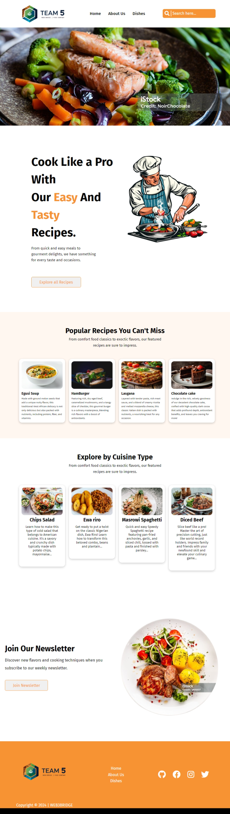

# Group 5 - Recipe Page App
 

## Table of contents

- [Group 5 - Recipe Page App](#group-5---recipe-page-app)
  - [Table of contents](#table-of-contents)
  - [Overview](#overview)
    - [Project Description](#project-description)
    - [The challenge](#the-challenge)
    - [Screenshot](#screenshot)
    - [Links](#links)
  - [My process](#my-process)
    - [Built with](#built-with)
    - [What we learned](#what-we-learned)
    - [Continued development](#continued-development)
    - [Useful resources](#useful-resources)
  - [Author](#author)
  - [Acknowledgments](#acknowledgments)

## Overview

### Project Description

This App will enable users to search for recipes and ingredient, see different kind of dishes, displaying a list of recipes with their images and users can view ingredients and instructions by clicking on the recipe.

### The challenge

The Challenges we faced include;

- Working within a given time frame  
- Contradicting Opinions
- Issues with pushing of different project into github

### Screenshot

### Links

- Solution URL: [https://nudarmediaworld.github.ioindex.html](https://your-solution-url.com)
- Live Site URL: [Add live site URL here](https://your-live-site-url.com)

## My process

### Built with

- Semantic HTML5 markup
- CSS custom properties
- Flexbox
- CSS Grid
- Mobile-first workflow
- Javascript
- [Styled Components](https://styled-components.com/) - For styles

### What we learned

We learnt about many things while working on this project, how to merge your personal work with the project, working with new people and how to relate with one another. Different Members worked on different pages like the landing page, the about us page, recipe page et cetera. Many of us learn how to use github in pushing and pulling of work, how to fork and clone another person's work to adjust some little things. We brainstorm whenever we are facing any issue which make our work more efficient and effective.  

### Continued development

Individually, everyone will like to learn more about HTML, CSS and most especially JAVASCRIPT.

### Useful resources

- [Scrimba V2](https://www.example.com) - Scrimba Video help us alot in learning about HTML AND CSS, it is self explanatory which make it more easy to understand.
- [Codeguage](https://www.example.com) - Codeguage really helped alot during this progect, we were able to sort some javascript problem with it. We'd recommend it to anyone still learning this concept.

## Author

- Website - [Group 5 Web2 Basic](https://www.your-site.com)
- Instagram - [https://www.group5.instagram.com](https://www.instagram.io/profile/yourusername)
- Twitter - [@Group 5 Web2 Basic](https://www.twitter.com/yourusername)

## Acknowledgments

We will like to Thank Almighty God for his grace that sustain us to the end of this project. Thanks to our mentor Blackadam we really appreciate all your effort and time may the good Lord bless you. We will like to appreciate every member of this team AZUBIUKE UGOCHUKWUD, PRINCE MICHEAL, TREASURE AMUKA, OMONIYI SIMISOLA, GABRIEL RACHAEL, OLUREMI MARY OBAKOYOWA, FAITH SAMUEL for their support and successful ending of this project.
